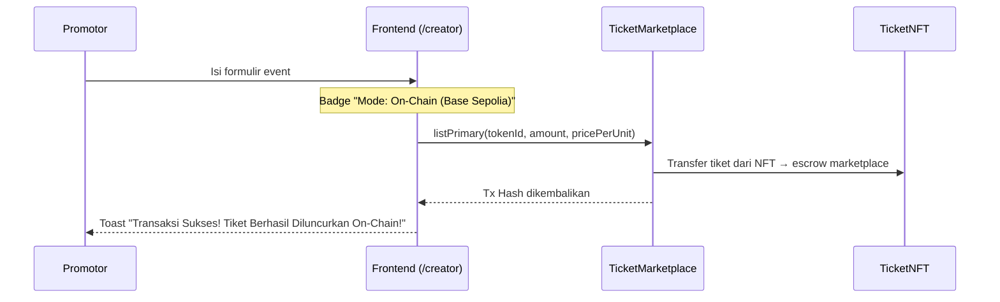
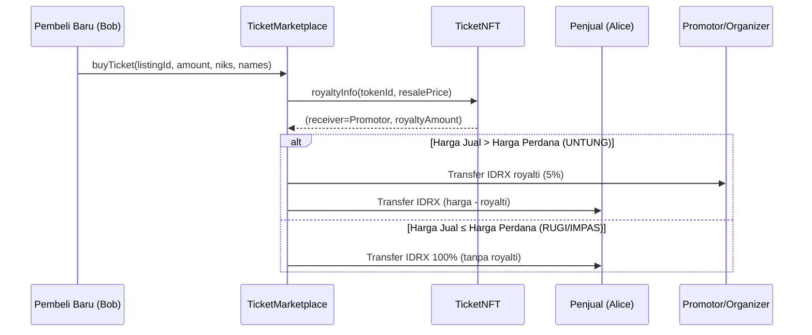
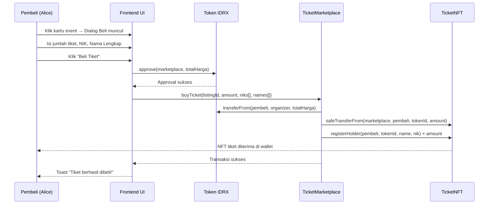
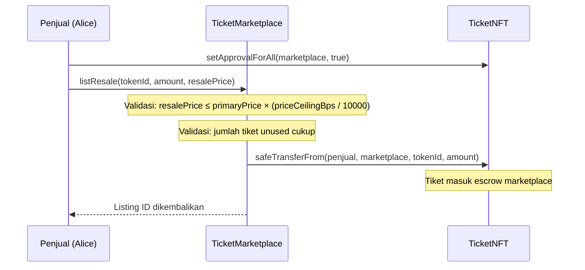
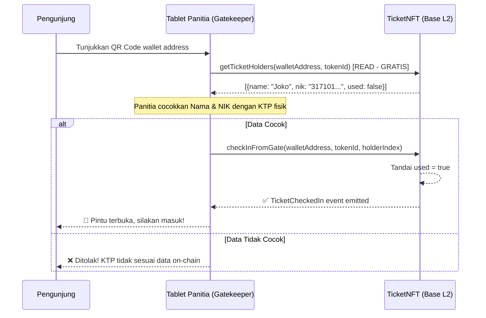

# Alur Testing - Protokol Billet (Smart Ticketing On-Chain)

> **Dokumen ini menjelaskan skenario testing end-to-end dari dua perspektif utama:**
> 1. **Sisi Pembeli Tiket** (Penonton / Fans)
> 2. **Sisi Pembuat Event** (Promotor / Penyelenggara)
>
> Setiap skenario mencakup alur UI (frontend), alur smart contract (on-chain), dan validasi yang diharapkan.

---

## Daftar Isi

- [1. Prasyarat & Setup Awal](#1-prasyarat--setup-awal)
- [2. Alur Testing - Sisi Pembuat Event (Promotor)](#2-alur-testing--sisi-pembuat-event-promotor)
  - [2.1. Membuat Event Baru (Mode Sandbox)](#21-membuat-event-baru-mode-sandbox)
  - [2.2. Membuat Event Baru (Mode On-Chain)](#22-membuat-event-baru-mode-on-chain)
  - [2.3. Konfigurasi Kategori Tiket](#23-konfigurasi-kategori-tiket)
  - [2.4. Mengatur Gatekeeper untuk Check-in](#24-mengatur-gatekeeper-untuk-check-in)
  - [2.5. Menerima Royalti dari Resale](#25-menerima-royalti-dari-resale)
- [3. Alur Testing - Sisi Pembeli Tiket (Penonton)](#3-alur-testing--sisi-pembeli-tiket-penonton)
  - [3.1. Menghubungkan Wallet](#31-menghubungkan-wallet)
  - [3.2. Menjelajahi & Mencari Event](#32-menjelajahi--mencari-event)
  - [3.3. Membeli Tiket Primary (Perdana)](#33-membeli-tiket-primary-perdana)
  - [3.4. Melihat Tiket yang Dimiliki](#34-melihat-tiket-yang-dimiliki)
  - [3.5. Menjual Kembali Tiket (Resale)](#35-menjual-kembali-tiket-resale)
  - [3.6. Membeli Tiket Resale](#36-membeli-tiket-resale)
  - [3.7. Membatalkan Listing Resale](#37-membatalkan-listing-resale)
  - [3.8. Check-in di Gerbang Fisik](#38-check-in-di-gerbang-fisik)
- [4. Skenario Negatif & Edge Cases](#4-skenario-negatif--edge-cases)
  - [4.1. Anti-Scalping: Price Ceiling](#41-anti-scalping-price-ceiling)
  - [4.2. Transfer Gating: Bypass Marketplace](#42-transfer-gating-bypass-marketplace)
  - [4.3. Jendela Waktu Penjualan (Sale Window)](#43-jendela-waktu-penjualan-sale-window)
  - [4.4. Double Check-in Prevention](#44-double-check-in-prevention)
  - [4.5. Resale Tiket Terpakai (Used Ticket)](#45-resale-tiket-terpakai-used-ticket)
  - [4.6. Check-in Tiket yang Sedang Di-listing](#46-check-in-tiket-yang-sedang-di-listing)
  - [4.7. Insufficient Payment](#47-insufficient-payment)
  - [4.8. Minting Melebihi Max Supply](#48-minting-melebihi-max-supply)
- [5. Matriks Test Case](#5-matriks-test-case)
- [6. Cara Menjalankan Test](#6-cara-menjalankan-test)

---

## 1. Prasyarat & Setup Awal

### Environment

| Komponen | Teknologi | Keterangan |
|----------|-----------|------------|
| Blockchain | Base Sepolia (L2 Testnet) | Gas fee sangat rendah |
| Smart Contract | Solidity ^0.8.24, Foundry | `TicketNFT.sol` + `TicketMarketplace.sol` |
| Frontend | Next.js + Wagmi + ConnectKit | Halaman: `/`, `/events`, `/creator`, `/my-tickets` |
| Token Pembayaran | IDRX (MockERC20, 18 decimals) | 1 IDRX = 1 Rupiah |
| Testing Framework | Foundry (Forge) | Unit, Integration, Fuzz test |

### Aktor dalam Sistem

| Aktor | Deskripsi | Alamat Test (Foundry) |
|-------|-----------|----------------------|
| **Organizer** | Promotor / pembuat event | `makeAddr("organizer")` |
| **Alice** | Pembeli tiket primary | `makeAddr("alice")` |
| **Bob** | Pembeli tiket secondary (resale) | `makeAddr("bob")` |
| **Carol** | Pembeli ketiga | `makeAddr("carol")` |
| **Gatekeeper** | Panitia di gerbang masuk | `makeAddr("gatekeeper")` |

### Token & Harga

| Token ID | Kategori | Harga Perdana | Max Supply | Price Ceiling |
|----------|----------|---------------|------------|---------------|
| 1 | Reguler | Rp 100.000 | 1.000 | 110% (11000 bps) |
| 2 | VIP | Rp 500.000 | 200 | 110% (11000 bps) |
| 3 | VVIP | Konfigurabel | 100 | Konfigurabel |

---

## 2. Alur Testing - Sisi Pembuat Event (Promotor)

### 2.1. Membuat Event Baru (Mode Sandbox)

**Tujuan:** Memastikan promotor bisa membuat event demo tanpa transaksi blockchain.

```
┌─────────────────────────────────────────────────────────┐
│  LANGKAH                                                │
├─────────────────────────────────────────────────────────┤
│  1. Buka halaman /creator                               │
│  2. Hubungkan wallet (non-owner)                        │
│  3. Lihat badge "Mode: Sandbox / Simulasi"              │
│  4. Isi formulir:                                       │
│     - Nama Event: "Konser Testing"                      │
│     - Kategori NFT: Reguler (Token #1)                  │
│     - Harga (IDRX): 150000                              │
│     - Jumlah Tiket: 500                                 │
│     - Kota: Jakarta                                     │
│     - Venue: "Stadion GBK"                              │
│     - Tanggal: "12 Juli 2026"                           │
│     - Price Ceiling: 10% (1.1x)                         │
│  5. Klik "Simulasikan (Sandbox)"                        │
│  6. Verifikasi toast sukses muncul                      │
│  7. Buka halaman / (homepage)                           │
│  8. Filter "Sandbox Demo" → event terlihat              │
└─────────────────────────────────────────────────────────┘
```

**Validasi:**
- [x] Data tersimpan di `localStorage` key `billet_simulated_events`
- [x] Event muncul di homepage dengan badge "Demo"
- [x] Tidak ada transaksi blockchain yang terjadi

---

### 2.2. Membuat Event Baru (Mode On-Chain)

**Tujuan:** Memastikan promotor (contract owner) bisa mint & list tiket di blockchain.



**Langkah Testing:**

1. Pastikan wallet terhubung adalah **contract owner**
2. Isi formulir dengan data event
3. Klik **"Luncurkan On-Chain"**
4. Approve transaksi di wallet (MetaMask/Rabby)
5. Tunggu konfirmasi blockchain

**Validasi:**
- [ ] Badge menunjukkan "Mode: On-Chain (Base Sepolia)"
- [ ] Transaksi `listPrimary` berhasil di blockchain
- [ ] Listing muncul di halaman `/events` dengan badge "On-Chain"
- [ ] `getListing(listingId)` mengembalikan data yang benar:
  - `seller` = alamat organizer
  - `active` = true
  - `isResale` = false
  - `pricePerUnit` = harga yang di-set

**Smart Contract Test:**
```bash
forge test --match-test test_ListPrimary_Success -vvv
forge test --match-test test_ListPrimary_EmitsEvent -vvv
```

---

### 2.3. Konfigurasi Kategori Tiket

**Tujuan:** Memastikan promotor dapat mengkonfigurasi parameter kategori tiket.

**Langkah Testing (Smart Contract):**

1. Panggil `configureTicketCategory(tokenId, maxSupply, primaryPrice, priceCeilingBps, royaltyBps, saleStart, saleEnd)`
2. Verifikasi storage:
   - `priceCeilingBps(tokenId)` sesuai input
   - `getSaleWindow(tokenId)` sesuai input
   - `royaltyInfo(tokenId, salePrice)` sesuai perhitungan

**Contoh Konfigurasi:**

| Parameter | Nilai | Keterangan |
|-----------|-------|------------|
| `tokenId` | 3 (VVIP) | Kategori VVIP |
| `maxSupply` | 100 | Maks 100 tiket |
| `primaryPrice` | 2 ether | Rp 2.000.000 |
| `priceCeilingBps` | 12000 | 120% dari harga asal |
| `royaltyBps` | 1000 | 10% royalti |
| `saleStart` | `block.timestamp + 1 hours` | Mulai 1 jam lagi |
| `saleEnd` | `block.timestamp + 3 hours` | Berakhir 3 jam lagi |

**Smart Contract Test:**
```bash
forge test --match-test test_ConfigureTicketCategory_CorrectStorage -vvv
```

---

### 2.4. Mengatur Gatekeeper untuk Check-in

**Tujuan:** Memastikan hanya gatekeeper resmi yang bisa check-in tiket.

**Langkah:**

1. Organizer memanggil `setGateKeeper(gatekeeperAddress, true)`
2. Organizer memanggil `setTicketCategoryName(tokenId, "REGULER")`
3. Verifikasi `isGateKeeper(gatekeeperAddress)` = true
4. Verifikasi `ticketCategoryName(tokenId)` = "REGULER"

**Skenario Negatif:**
- Non-owner mencoba `setGateKeeper` → **REVERT** (OwnableUnauthorizedAccount)
- Non-owner mencoba `setTicketCategoryName` → **REVERT**

**Smart Contract Test:**
```bash
forge test --match-test test_Admin_ConfigureGateKeeperAndCategoryNames -vvv
```

---

### 2.5. Menerima Royalti dari Resale

**Tujuan:** Memastikan royalti langsung masuk ke wallet organizer saat resale untung.



**Validasi Perhitungan Royalti:**

| Skenario | Harga Beli | Harga Jual | Royalti (5%) | Penjual Dapat |
|----------|------------|------------|--------------|---------------|
| Jual Untung | Rp 100.000 | Rp 110.000 | Rp 5.500 | Rp 104.500 |
| Jual Rugi | Rp 100.000 | Rp 80.000 | Rp 0 | Rp 80.000 |
| Jual Impas | Rp 100.000 | Rp 100.000 | Rp 0 | Rp 100.000 |
| Royalti Off | Rp 100.000 | Rp 110.000 | Rp 0 (disabled) | Rp 110.000 |

**Smart Contract Test:**
```bash
forge test --match-test test_Resale_JualUntung_RoyaltyDikenakan -vvv
forge test --match-test test_Resale_JualRugi_RoyaltyNol -vvv
forge test --match-test test_Resale_JualUntung_BebasRoyalti -vvv
forge test --match-test test_RoyaltyDirectRouting_Success -vvv
```

---

## 3. Alur Testing - Sisi Pembeli Tiket (Penonton)

### 3.1. Menghubungkan Wallet

**Tujuan:** Memastikan koneksi wallet berjalan lancar di semua halaman.

**Langkah:**

```
┌────────────────────────────────────────────┐
│  1. Buka halaman mana saja                 │
│  2. Klik tombol "Connect Wallet" (Navbar)  │
│  3. Pilih wallet (MetaMask, Rabby, dll)    │
│  4. Approve koneksi di wallet extension    │
│  5. Verifikasi alamat wallet tampil        │
│     di Navbar (truncated address)          │
└────────────────────────────────────────────┘
```

**Validasi per Halaman:**

| Halaman | Sebelum Connect | Setelah Connect |
|---------|-----------------|-----------------|
| `/` (Homepage) | Tetap bisa browse event | Bisa klik "Beli" untuk on-chain |
| `/events` | Bisa lihat listing, tidak bisa beli | Dialog beli aktif |
| `/creator` | Formulir terkunci, minta connect | Formulir terbuka |
| `/my-tickets` | Pesan "Hubungkan Wallet" | Tiket dimuat dari blockchain |

---

### 3.2. Menjelajahi & Mencari Event

**Tujuan:** Memastikan fitur filter dan pencarian bekerja dengan benar.

**Langkah Testing:**

1. **Pencarian Teks:**
   - Ketik "Tulus" di search bar → hanya event "Tulus" yang muncul
   - Ketik "GBK" → event di Stadion GBK yang muncul
   - Ketik teks random → tampilkan "Event Tidak Ditemukan"

2. **Filter Kategori:**
   - Klik "Musik" → hanya event kategori Musik
   - Klik "Seminar" → hanya event kategori Seminar
   - Klik "Semua" → reset ke seluruh event

3. **Filter Kota:**
   - Klik kota "Jakarta" → hanya event di Jakarta
   - Klik kota yang sama → toggle off (reset)

4. **Filter Tipe:**
   - Klik "On-Chain Base" → hanya listing dari blockchain
   - Klik "Sandbox Demo" → hanya event simulasi/mock
   - Klik "Semua" → tampilkan semua

5. **Reset Filter:**
   - Klik "Reset Filter" → semua filter kembali default

**Validasi:**
- [ ] Filter kombinasi (Kategori + Kota + Tipe) bekerja bersamaan
- [ ] Jumlah listing aktif terupdate di badge
- [ ] Event card menampilkan badge yang tepat (On-Chain / Demo / Resale)

---

### 3.3. Membeli Tiket Primary (Perdana)

**Tujuan:** Memastikan pembeli bisa membeli tiket dari pasar perdana.



**Langkah Testing Frontend:**

1. Buka halaman `/events` atau `/` (Homepage)
2. Klik event card yang ber-label **On-Chain**
3. Dialog pembelian muncul:
   - Isi jumlah tiket (misal: 2)
   - Isi NIK untuk tiap tiket: "3171012345670001", "3171012345670002"
   - Isi Nama untuk tiap tiket: "Joko", "Siti"
4. Klik **"Beli Tiket"**
5. Approve transaksi IDRX di wallet
6. Approve transaksi `buyTicket` di wallet
7. Tunggu konfirmasi blockchain

**Validasi:**
- [ ] Saldo IDRX pembeli berkurang sebesar `jumlah × harga`
- [ ] `balanceOf(pembeli, tokenId)` bertambah sebesar `jumlah`
- [ ] `getTicketHolders(pembeli, tokenId)` berisi data NIK & Nama yang benar
- [ ] Listing `amount` berkurang sesuai jumlah beli
- [ ] Jika sold out, `listing.active` = false
- [ ] Saldo IDRX organizer bertambah sebesar `totalHarga`

**Smart Contract Test:**
```bash
forge test --match-test test_BuyPrimary_Success -vvv
forge test --match-test test_BuyPrimary_ExactPull -vvv
forge test --match-test test_BuyPrimary_WithOnChainIdentityRegistration -vvv
forge test --match-test test_BuyPrimary_ListingBecomesInactiveWhenSoldOut -vvv
```

---

### 3.4. Melihat Tiket yang Dimiliki

**Tujuan:** Memastikan halaman `/my-tickets` menampilkan tiket yang dimiliki.

**Langkah:**

1. Buka halaman `/my-tickets`
2. Pastikan wallet sudah terhubung
3. Verifikasi tiket muncul sesuai kategori (Reguler, VIP, VVIP)
4. Setiap kartu tiket menampilkan:
   - Nama pemegang
   - NIK pemegang
   - Status check-in (belum/sudah terpakai)
   - Token ID & kategori

**Validasi:**
- [ ] Counter "X tiket" dan "X terpakai" akurat
- [ ] Tiket dikelompokkan per kategori
- [ ] Status `used` ditampilkan dengan benar
- [ ] Empty state muncul jika tidak punya tiket

---

### 3.5. Menjual Kembali Tiket (Resale)

**Tujuan:** Memastikan pembeli bisa mendaftarkan tiket untuk dijual kembali.



**Langkah:**

1. Dari halaman `/my-tickets`, pilih tiket yang ingin dijual
2. Set harga resale (harus ≤ price ceiling)
3. Approve marketplace untuk mengakses tiket
4. Konfirmasi listing

**Validasi:**
- [ ] Harga resale tidak melebihi price ceiling (110% dari harga perdana)
- [ ] Tiket berpindah ke escrow marketplace
- [ ] `balanceOf(penjual, tokenId)` berkurang
- [ ] Listing baru muncul di `/events` dengan badge "Resale"
- [ ] Saldo tiket yang belum dipakai (unused) cukup

**Smart Contract Test:**
```bash
forge test --match-test test_Resale_JualUntung_RoyaltyDikenakan -vvv
forge test --match-test test_Resale_NotRestrictedBySaleWindow -vvv
```

---

### 3.6. Membeli Tiket Resale

**Tujuan:** Memastikan pembeli baru bisa membeli tiket dari pasar sekunder.

**Langkah:**

1. Buka halaman `/events`
2. Filter "Resale" → tampilkan listing resale
3. Klik listing resale
4. Isi NIK dan Nama baru (pembeli baru)
5. Konfirmasi pembelian

**Validasi Sinkronisasi Identitas:**

```
SEBELUM:
  Alice → getTicketHolders → [{name: "Alice", nik: "xxx", used: false}]
  Bob   → getTicketHolders → []

SESUDAH RESALE:
  Alice → getTicketHolders → []                          ← Data terhapus otomatis
  Bob   → getTicketHolders → [{name: "Bob", nik: "yyy", used: false}]  ← Data baru
```

**Validasi:**
- [ ] Identitas penjual lama dihapus (`removeHolder`)
- [ ] Identitas pembeli baru didaftarkan (`registerHolder`)
- [ ] Tiket berpindah dari escrow ke pembeli baru
- [ ] Royalti (jika untung) langsung ke organizer
- [ ] Penjual menerima sisa pembayaran

**Smart Contract Test:**
```bash
forge test --match-test test_Resale_IdentityResync_OnSecondaryPurchase -vvv
```

---

### 3.7. Membatalkan Listing Resale

**Tujuan:** Memastikan penjual bisa membatalkan listing resale.

**Langkah:**

1. Penjual memanggil `cancelListing(listingId)`
2. Tiket dikembalikan dari escrow ke penjual

**Validasi:**
- [ ] `balanceOf(penjual, tokenId)` bertambah kembali
- [ ] `listing.active` = false
- [ ] Hanya penjual asli yang bisa cancel (bukan orang lain)

**Smart Contract Test:**
```bash
forge test --match-test test_CancelListing_ReturnsTicketToSeller -vvv
forge test --match-test test_CancelListing_RevertIfNotSeller -vvv
```

---

### 3.8. Check-in di Gerbang Fisik

**Tujuan:** Memastikan proses verifikasi dan check-in tiket berjalan lancar.



**Langkah Testing:**

1. **Setup:**
   - Organizer set gatekeeper: `setGateKeeper(gatekeeperAddr, true)`
   - Alice sudah memiliki tiket dengan data identitas terdaftar

2. **Proses Check-in:**
   - Gatekeeper scan QR Code Alice (wallet address)
   - Panggil `getTicketHolders(alice, tokenId)` → data NIK & Nama muncul
   - Cocokkan dengan KTP fisik
   - Panggil `checkInFromGate(alice, tokenId, 0)`

3. **Pasca Check-in:**
   - `holders[0].used` = true
   - `balanceOf(alice, tokenId)` tetap = 1 (NFT tidak dibakar, jadi souvenir)
   - Tiket tidak bisa digunakan untuk check-in lagi
   - Tiket tidak bisa dijual kembali

**Validasi:**
- [ ] Event `TicketCheckedIn` ter-emit
- [ ] Status tiket berubah ke `used = true`
- [ ] NFT tetap di wallet (preservasi sebagai POAP/souvenir)
- [ ] Gas fee ditanggung gatekeeper, bukan pengunjung

**Smart Contract Test:**
```bash
forge test --match-test test_GateCheckIn_Success -vvv
```

---

## 4. Skenario Negatif & Edge Cases

### 4.1. Anti-Scalping: Price Ceiling

**Skenario:** Calo mencoba menjual tiket di atas batas harga.

| Test Case | Harga Jual | Ceiling (110%) | Hasil |
|-----------|------------|----------------|-------|
| Jual 200% harga asal | Rp 200.000 | Rp 110.000 | ❌ REVERT `PriceCeilingExceeded` |
| Jual tepat 110% | Rp 110.000 | Rp 110.000 | ✅ Berhasil |
| Jual 100% (face value) | Rp 100.000 | Rp 110.000 | ✅ Berhasil |
| Ceiling 100%: Jual +Rp1 | Rp 100.001 | Rp 100.000 | ❌ REVERT `PriceCeilingExceeded` |
| Ceiling 100%: Jual sama | Rp 100.000 | Rp 100.000 | ✅ Berhasil |

**Smart Contract Test:**
```bash
forge test --match-test test_Resale_RevertIfExceedsPriceCeiling -vvv
forge test --match-test test_Resale_CustomPriceCeiling_100Percent -vvv
```

---

### 4.2. Transfer Gating: Bypass Marketplace

**Skenario:** Pemilik tiket mencoba transfer langsung P2P (tanpa marketplace).

```
Alice memiliki 1 tiket VIP
Alice → safeTransferFrom(alice, bob, TOKEN_VIP, 1, "")
⛔ REVERT: UnauthorizedTransfer
```

**Validasi:**
- [ ] Transfer dari user → user langsung: **DITOLAK**
- [ ] Transfer dari marketplace → user: **DIIZINKAN**
- [ ] Mint (from address(0)): **DIIZINKAN**

**Smart Contract Test:**
```bash
forge test --match-test test_TransferGating_RevertIfDirectUserToUser -vvv
forge test --match-test test_TransferGating_AllowMarketplaceTransfer -vvv
```

---

### 4.3. Jendela Waktu Penjualan (Sale Window)

**Skenario:** Pembeli mencoba membeli tiket di luar jendela waktu penjualan.

```
Timeline:
──────────────────────────────────────────────────────────
  ↑ SEBELUM        ↑ saleStart      ↑ saleEnd      ↑ SESUDAH
  ❌ SaleNotStarted  ✅ Bisa beli     ✅ Bisa beli    ❌ SaleEnded
                     (inclusive)      (inclusive)
```

| Test Case | Waktu | Hasil |
|-----------|-------|-------|
| 1 detik sebelum `saleStart` | `start - 1` | ❌ REVERT `SaleNotStarted` |
| Tepat di `saleStart` | `start` | ✅ Berhasil |
| Di tengah sale window | `start + 10min` | ✅ Berhasil |
| Tepat di `saleEnd` | `end` | ✅ Berhasil |
| 1 detik setelah `saleEnd` | `end + 1` | ❌ REVERT `SaleEnded` |
| Resale di luar window | `end + 1 hour` | ✅ Berhasil (resale bebas window) |

> **Catatan Penting:** Jendela waktu **hanya berlaku untuk pembelian primary**. Resale di pasar sekunder tidak dibatasi oleh sale window.

**Smart Contract Test:**
```bash
forge test --match-test test_BuyPrimary_RevertIfSaleNotStarted -vvv
forge test --match-test test_BuyPrimary_RevertIfSaleEnded -vvv
forge test --match-test test_BuyPrimary_SuccessWithinSaleWindow -vvv
forge test --match-test test_BuyPrimary_BoundaryTimeManipulation -vvv
forge test --match-test test_Resale_NotRestrictedBySaleWindow -vvv
```

---

### 4.4. Double Check-in Prevention

**Skenario:** Gatekeeper mencoba check-in tiket yang sudah terpakai.

```
Check-in #1: checkInFromGate(alice, TOKEN_REGULER, 0)  → ✅ Sukses
Check-in #2: checkInFromGate(alice, TOKEN_REGULER, 0)  → ❌ REVERT "Ticket already used"
```

**Smart Contract Test:**
```bash
forge test --match-test test_GateCheckIn_RevertIfAlreadyUsed -vvv
```

---

### 4.5. Resale Tiket Terpakai (Used Ticket)

**Skenario:** Pemegang tiket mencoba menjual kembali tiket yang sudah di-check-in.

```
1. Alice beli tiket → check-in → used = true
2. Alice coba listResale() → ❌ REVERT InsufficientUnusedTickets(0, 1)
```

**Validasi:**
- [ ] Sistem menghitung jumlah tiket unused sebelum mengizinkan listing
- [ ] Tiket terpakai tidak bisa dijual kembali

**Smart Contract Test:**
```bash
forge test --match-test test_Resale_RevertIfInsufficientUnusedTickets -vvv
```

---

### 4.6. Check-in Tiket yang Sedang Di-listing

**Skenario:** Tiket sudah dipindahkan ke escrow marketplace (sedang dijual), lalu dicoba check-in.

```
1. Alice beli tiket → balanceOf(alice) = 1
2. Alice listResale() → tiket masuk escrow → balanceOf(alice) = 0
3. Gatekeeper checkInFromGate(alice, tokenId, 0) → ❌ REVERT "Insufficient ticket balance in wallet"
```

**Smart Contract Test:**
```bash
forge test --match-test test_GateCheckIn_RevertIfTicketListed -vvv
```

---

### 4.7. Insufficient Payment

**Skenario:** Pembeli tidak memiliki saldo/allowance IDRX yang cukup.

```
Alice allowance ke marketplace = 0
Alice coba buyTicket() → ❌ REVERT InsufficientPayment(0, PRICE_REGULER)
```

**Smart Contract Test:**
```bash
forge test --match-test test_BuyPrimary_RevertIfInsufficientPayment -vvv
```

---

### 4.8. Minting Melebihi Max Supply

**Skenario:** Organizer mencoba mint tiket melebihi kuota.

```
Max Supply REGULER = 1.000
Organizer mint 1.001 → ❌ REVERT ExceedsMaxSupply(TOKEN_REGULER, 1001, 1000)
```

**Smart Contract Test:**
```bash
forge test --match-test test_MintToMarketplace_RevertIfExceedsMaxSupply -vvv
```

---

## 5. Matriks Test Case

### Sisi Pembuat Event (Promotor)

| # | Test Case | Jenis | Expected Result | Command |
|---|-----------|-------|-----------------|---------|
| P1 | Buat event mode sandbox | UI | Event tersimpan di localStorage | Manual |
| P2 | Buat event mode on-chain | UI + SC | Listing muncul di blockchain | `test_ListPrimary_Success` |
| P3 | List primary sebagai non-owner | SC | REVERT (Unauthorized) | `test_ListPrimary_RevertIfNotOwner` |
| P4 | List primary jumlah 0 | SC | REVERT (ZeroAmount) | `test_ListPrimary_RevertIfZeroAmount` |
| P5 | Konfigurasi kategori tiket | SC | Storage tersimpan benar | `test_ConfigureTicketCategory_CorrectStorage` |
| P6 | Set gatekeeper | SC | isGateKeeper = true | `test_Admin_ConfigureGateKeeperAndCategoryNames` |
| P7 | Mint melebihi max supply | SC | REVERT (ExceedsMaxSupply) | `test_MintToMarketplace_RevertIfExceedsMaxSupply` |
| P8 | Mint tanpa set marketplace | SC | REVERT (MarketplaceNotSet) | `test_MintToMarketplace_RevertIfMarketplaceNotSet` |
| P9 | Mint sebagai non-owner | SC | REVERT (Unauthorized) | `test_MintToMarketplace_RevertIfNotOwner` |
| P10 | Terima royalti resale untung | SC | Saldo organizer bertambah | `test_RoyaltyDirectRouting_Success` |

### Sisi Pembeli Tiket (Penonton)

| # | Test Case | Jenis | Expected Result | Command |
|---|-----------|-------|-----------------|---------|
| B1 | Beli tiket primary sukses | SC | Tiket diterima, saldo terpotong | `test_BuyPrimary_Success` |
| B2 | Beli tiket + registrasi identitas | SC | NIK & Nama tersimpan on-chain | `test_BuyPrimary_WithOnChainIdentityRegistration` |
| B3 | Beli tiket saldo tidak cukup | SC | REVERT (InsufficientPayment) | `test_BuyPrimary_RevertIfInsufficientPayment` |
| B4 | Beli tiket listing tidak aktif | SC | REVERT (ListingNotActive) | `test_BuyPrimary_RevertIfListingNotActive` |
| B5 | Beli tiket sebelum sale window | SC | REVERT (SaleNotStarted) | `test_BuyPrimary_RevertIfSaleNotStarted` |
| B6 | Beli tiket setelah sale window | SC | REVERT (SaleEnded) | `test_BuyPrimary_RevertIfSaleEnded` |
| B7 | Beli tiket di dalam sale window | SC | Sukses | `test_BuyPrimary_SuccessWithinSaleWindow` |
| B8 | Beli tiket boundary time test | SC | Boundary tepat benar | `test_BuyPrimary_BoundaryTimeManipulation` |
| B9 | Array NIK/Nama mismatch | SC | REVERT (ArrayLengthMismatch) | `test_Buy_RevertIfArrayLengthMismatch` |
| B10 | Listing sold out → inactive | SC | listing.active = false | `test_BuyPrimary_ListingBecomesInactiveWhenSoldOut` |
| B11 | Transfer langsung (bypass) | SC | REVERT (UnauthorizedTransfer) | `test_TransferGating_RevertIfDirectUserToUser` |
| B12 | Resale tiket untung + royalti | SC | Royalti ke organizer | `test_Resale_JualUntung_RoyaltyDikenakan` |
| B13 | Resale tiket rugi (royalti 0) | SC | Tidak ada royalti | `test_Resale_JualRugi_RoyaltyNol` |
| B14 | Resale harga > ceiling | SC | REVERT (PriceCeilingExceeded) | `test_Resale_RevertIfExceedsPriceCeiling` |
| B15 | Resale ceiling 100% | SC | Tepat face value berhasil | `test_Resale_CustomPriceCeiling_100Percent` |
| B16 | Resale di luar sale window | SC | Sukses (window tidak berlaku) | `test_Resale_NotRestrictedBySaleWindow` |
| B17 | Cancel listing resale | SC | Tiket kembali ke penjual | `test_CancelListing_ReturnsTicketToSeller` |
| B18 | Cancel listing oleh bukan penjual | SC | REVERT (NotSeller) | `test_CancelListing_RevertIfNotSeller` |
| B19 | Sinkronisasi identitas resale | SC | Data lama dihapus, baru ditambah | `test_Resale_IdentityResync_OnSecondaryPurchase` |
| B20 | Check-in tiket sukses | SC | used = true, NFT tetap | `test_GateCheckIn_Success` |
| B21 | Check-in oleh non-gatekeeper | SC | REVERT (NotGateKeeper) | `test_GateCheckIn_RevertIfNotGateKeeper` |
| B22 | Double check-in | SC | REVERT (already used) | `test_GateCheckIn_RevertIfAlreadyUsed` |
| B23 | Check-in tiket sedang listing | SC | REVERT (insufficient balance) | `test_GateCheckIn_RevertIfTicketListed` |
| B24 | Resale tiket terpakai | SC | REVERT (InsufficientUnusedTickets) | `test_Resale_RevertIfInsufficientUnusedTickets` |

### Fuzz Tests

| # | Test Case | Keterangan | Command |
|---|-----------|------------|---------|
| F1 | Price Ceiling konsistensi | Random price & ceiling bps | `testFuzz_PriceCeiling_NeverExceedsCeilingBps` |
| F2 | Royalti ≤ total pembayaran | Random resale price | `testFuzz_Royalty_NeverExceedsTotal` |

### Integration Tests (Full Flow)

| # | Test Case | Keterangan | Command |
|---|-----------|------------|---------|
| I1 | Primary → Resale → Royalti | Full E2E flow | `test_FullFlow_PrimaryToResaleToRoyaltyWithdrawal` |
| I2 | Anti-scalping enforcement | Calo gagal listing | `test_FullFlow_AntiScalping_CeilingEnforced` |
| I3 | Transfer gating bypass | Direct transfer gagal | `test_FullFlow_TransferGating_NoBypassing` |

---

## 6. Cara Menjalankan Test

### Menjalankan Semua Test

```bash
cd contracts
forge test -vvv
```

### Test per File

```bash
# Unit Test - TicketNFT
forge test --match-path test/unit/TicketNFT.t.sol -vvv

# Unit Test - TicketMarketplace
forge test --match-path test/unit/TicketMarketplace.t.sol -vvv

# Integration Test - Full Flow
forge test --match-path test/integration/FullFlow.t.sol -vvv
```

### Test per Fungsi Spesifik

```bash
# Contoh: test resale jual untung
forge test --match-test test_Resale_JualUntung_RoyaltyDikenakan -vvv

# Contoh: test anti-scalping
forge test --match-test test_Resale_RevertIfExceedsPriceCeiling -vvv
```

### Fuzz Test (1000 Runs)

```bash
forge test --match-test testFuzz -vvv --fuzz-runs 1000
```

### Coverage Report

```bash
# Summary
forge coverage --report summary

# HTML Report
forge coverage --report lcov
genhtml lcov.info -o coverage-report
open coverage-report/index.html
```

### Gas Profiling

```bash
forge test --gas-report
```

### Static Analysis (Slither)

```bash
pip3 install slither-analyzer
slither src/ --solc-remaps "@openzeppelin/=lib/openzeppelin-contracts/"

# Export ke JSON
slither src/ --solc-remaps "@openzeppelin/=lib/openzeppelin-contracts/" \
  --json slither-report.json
```

---

> **Target Coverage:** 100% pada `TicketNFT.sol`, `TicketMarketplace.sol`, dan `PriceLib.sol`
> 
> **Target Security:** Zero high/medium severity findings pada Slither
