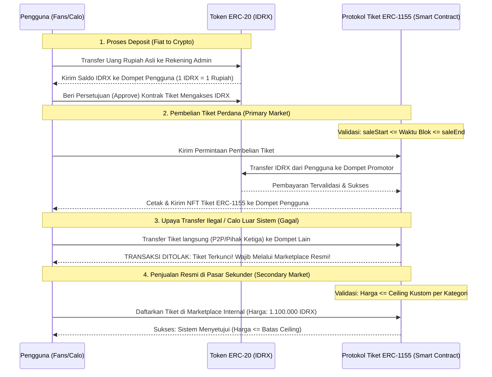

# Proposal & Rancangan Konseptual: Protokol Smart Ticketing On-Chain
**Integrasi Komprehensif Mekanisme Anti-Scalping Berbasis Web3**

Dokumen ini merupakan penggabungan terstruktur dari **Dokumen Konteks** dan **Proposal Teknis**. Dokumen ini dirancang sepenuhnya secara konseptual tanpa menyertakan kode program mentah (*source code*), melainkan menggunakan penjelasan analitis, diagram alur, dan tabel penjelas agar sangat sesuai sebagai dokumen usulan penelitian (skripsi) maupun arsitektur sistem.

---

## 1. Judul Penelitian (Provisional)
**"Implementasi Protokol Smart Ticketing On-Chain Berbasis ERC-1155 dengan Mekanisme Trustless Escrow dan Restriksi Ekonomi untuk Mitigasi Scalping"**

---

## 2. Latar Belakang & Pernyataan Masalah

Sistem tiket acara (seperti konser musik atau pertandingan olahraga) saat ini menghadapi tantangan besar yang merugikan penyelenggara acara (promotor) sekaligus konsumen (penggemar). Terdapat tiga kegagalan utama dari model yang ada saat ini:

### 2.1. Kegagalan Sistem Web2 Tradisional (Counterparty Risk & Kerentanan Bot)
Pada platform Web2 terpusat (seperti Loket.com atau Kiostix), calo tiket menggunakan program otomatis (*bot*) untuk memborong tiket dalam hitungan detik setelah penjualan dibuka. Karena tidak ada kontrol pada pasar sekunder (transaksi P2P melalui media sosial), calo dapat menjual kembali tiket dengan markup hingga 500%. 
*   **Risiko Pihak Kedua (Counterparty Risk):** Sangat tinggi. Pembeli di pasar sekunder sering menjadi korban penipuan (mentransfer uang tetapi tiket tidak dikirim, atau menerima tiket PDF/barcode palsu yang telah dijual ke beberapa orang sekaligus).

### 2.2. Kegagalan NFT Konvensional (Value Extraction)
Mengubah tiket menjadi aset digital unik (NFT standar ERC-721) di jaringan blockchain menyelesaikan masalah keaslian dan mencegah penggandaan tiket (*double-spending*). Namun, **NFT konvensional tidak menyelesaikan masalah calo**. Calo tetap dapat membeli NFT tiket pada harga perdana (*primary market*), lalu menjualnya kembali secara bebas di pasar gelap atau marketplace NFT eksternal (seperti OpenSea) dengan harga tak terbatas. Seluruh surplus ekonomi tetap dinikmati oleh calo (*value extraction*).

### 2.3. Kehilangan Potensi Pendapatan Promotor (Revenue Leakage)
Pada pasar sekunder tradisional (baik fisik maupun digital Web2), promotor kehilangan 100% potensi pendapatan dari transaksi jual-kembali tiket. Tidak ada mekanisme otomatis untuk menyalurkan sebagian dari nilai transaksi sekunder sebagai royalti kembali kepada pembuat acara asli.

---

## 3. Solusi yang Diusulkan (Closed-Loop Ecosystem)

Skripsi ini mengusulkan sebuah protokol penjualan tiket berbasis **100% Pure Web3** yang berjalan di atas jaringan **Base (Layer 2)** untuk menjamin efisiensi biaya gas. Protokol ini menciptakan ekosistem tertutup (*Closed-Loop Ecosystem*) dengan lima pilar solusi utama:

1.  **Sistem Pembayaran Stabil (IDRX Token):** Menggunakan token ERC-20 IDRX (Rupiah Digital) sebagai alat pembayaran resmi di platform untuk menghindari volatilitas harga crypto yang ekstrem.
2.  **Mekanisme Rekening Bersama Tanpa Perantara (Trustless Escrow):** Logika jual-beli tiket bekas langsung ditangani oleh *smart contract*. Pembeli baru menyetor dana ke kontrak, tiket dipindahkan secara otomatis, dan dana diteruskan ke penjual lama secara real-time dan aman tanpa perantara pihak ketiga.
3.  **Penegakan Batas Atas Harga Kustom (Customizable Price Ceiling Enforcement):** Penyelenggara acara (promotor) dapat menentukan batas harga jual kembali sekunder secara kustom per kategori tiket (misal 110% untuk kategori VIP, 100% *face-value* untuk tiket reguler/amal) alih-alih menggunakan persentase statis yang di-*hardcode* di sistem. Batas ini disimpan langsung pada *smart contract* NFT untuk menjamin transparansi, dan segala upaya transaksi di atas batas ini akan langsung digagalkan oleh blockchain secara otomatis.
4.  **Royalti Bersyarat & Fleksibel (Conditional & Customizable Royalty - ERC-2981):** Sistem menerapkan persentase royalti dinamis yang dikonfigurasi secara mandiri oleh penyelenggara saat pembuatan tiket (misalnya 5%, atau 0% jika ingin menonaktifkan royalti sepenuhnya). Jika tiket dijual kembali dengan keuntungan (misalnya dibeli 1.000.000 IDRX, dijual kembali 1.100.000 IDRX), promotor mendapatkan royalti sesuai tarif yang telah disetel. Namun, jika tiket dijual rugi atau sama dengan harga asli, royalti otomatis dipotong menjadi 0% untuk menjaga likuiditas darurat bagi penggemar.
5.  **Batasan Jendela Waktu Penjualan Perdana (Sales Time Window):** Protokol menyediakan fitur pengaturan rentang waktu mulai (`saleStart`) dan selesai (`saleEnd`) penjualan tiket perdana secara *on-chain* untuk setiap kategori tiket. Ini membatasi transaksi pembelian pasar perdana (*primary sale*) di marketplace hanya dalam jendela waktu yang telah ditentukan, memberikan otomatisasi penuh bagi penyelenggara untuk mengelola jadwal penjualan (seperti *presale* atau *early bird*) tanpa perlu membuka/menutup penjualan secara manual, sekaligus melindungi sistem dari eksploitasi pembelian di luar waktu resmi.

---

## 4. Arsitektur Komponen & Diagram Interaksi

Sistem ini mendelegasikan seluruh aturan bisnis dan penyimpanan status kepemilikan langsung ke jaringan blockchain (Base L2) tanpa database terpusat.

### 4.1. Diagram Interaksi Konseptual (Sequence Diagram)

### 4.2. Deskripsi Komponen Teknis
*   **Standar Token ERC-1155:** Digunakan untuk mengelola berbagai kategori tiket (seperti VIP, VVIP, dan Reguler) dalam satu *smart contract* tunggal. Ini jauh lebih hemat biaya gas dibandingkan standar ERC-721 yang membutuhkan kontrak terpisah untuk setiap kategori tiket.
*   **Monolithic Marketplace & Escrow Contract:** Menggabungkan logika kepemilikan tiket, pencatatan penjualan, dan penahanan dana (escrow) dalam satu arsitektur terpadu guna menekan biaya komputasi jaringan (*gas fee*).
*   **Base Layer 2 (L2) Network:** Blockchain tujuan penyebaran (*deployment*) untuk memastikan biaya setiap transaksi (*gas fee*) tetap berada di bawah Rp100 per operasi, sehingga ramah bagi penonton konser umum.

---

## 5. Mekanisme Algoritma & Logika Bisnis (Tanpa Kode)

Protokol ini bekerja dengan menerapkan tiga aturan logika ketat secara *on-chain*:

### 5.1. Restriksi Transfer Mandiri (Anti-OTC Bypass)
Kontrak pintar tiket melakukan *override* pada fungsi transfer bawaan standar token (fungsi `_update` pada standar ERC-1155). 
*   **Aturan:** Tiket NFT hanya diperbolehkan berpindah tangan jika dan hanya jika panggilan transfer tersebut diinisiasi oleh alamat Kontrak Marketplace Resmi. 
*   **Dampak:** Pemilik tiket tidak dapat mengirim tiketnya secara langsung (P2P) ke dompet orang lain melalui aplikasi dompet eksternal (seperti MetaMask). Hal ini memaksa seluruh transaksi sekunder tunduk pada aturan *Price Ceiling* dan pembagian royalti yang ada di platform.

### 5.2. Penegakan Batas Atas Harga Kustom (Customizable Price Ceiling Validation)
*   **Aturan:** Kontrak pintar menyimpan data `primaryPrice` dan `priceCeilingBps` (dalam basis points, misal 11000 = 110%, 10000 = 100%) untuk setiap kategori tiket yang dikonfigurasi oleh promotor. Ketika pengguna mendaftarkan tiketnya untuk dijual kembali di pasar sekunder, kontrak Marketplace akan memanggil parameter ini dari NFT secara dinamis.
*   **Rumus Kelayakan:** 
    $$\text{Harga Maksimal} = \frac{\text{Harga Perdana} \times \text{priceCeilingBps}}{10000}$$
*   **Keputusan:** Jika $\text{Harga Jual Kembali} > \text{Harga Maksimal}$, kontrak pintar akan membatalkan eksekusi secara otomatis dan mengeluarkan revert error `PriceCeilingExceeded`.

### 5.3. Pemrosesan Royalti Dinamis & Opsional (Conditional & Customizable Royalty - ERC-2981)
Saat transaksi di pasar sekunder berhasil dieksekusi oleh pembeli baru:
1.  **Jika Penjual Untung ($\text{Harga Jual} > \text{Harga Perdana}$):**
    *   Kontrak memanggil fungsi standard `royaltyInfo` dari NFT untuk mendapatkan alamat penerima royalti (*royalty receiver*) yang sah dan menghitung jumlah royalti secara dinamis sesuai persentase yang disetel promotor saat pembuatan tiket (misalnya 5%, atau 0% jika dinonaktifkan sepenuhnya).
    *   Sistem memotong saldo pembeli sesuai tarif royalti terhitung untuk ditransfer langsung (*direct routing*) ke alamat penerima (*receiver*) tersebut saat itu juga. Hal ini menghilangkan kebutuhan akan fungsi penarikan manual (*withdrawRoyalties*) yang menimbulkan risiko sentralisasi.
    *   Sisa dana (Total dikurangi royalti) diteruskan sepenuhnya ke penjual tiket.
2.  **Jika Penjual Rugi/Impas ($\text{Harga Jual} \le \text{Harga Perdana}$):**
    *   Sistem secara otomatis mengabaikan tarif default dan membebaskan penjual dari biaya royalti (Royalti = 0%).
    *   100% dana dari pembeli baru disalurkan utuh kepada penjual lama untuk meminimalisasi kerugian pengguna yang batal menonton.
3.  **Perpindahan Tiket:** Tiket secara atomik (dalam satu transaksi yang sama) dibuka kuncinya, dipindahkan ke pembeli baru, dan dikunci kembali di dompet yang baru.

### 5.4. Pembatasan Jendela Waktu Penjualan Perdana (Sales Time Window Validation)
*   **Aturan:** Setiap kategori tiket dapat dikonfigurasi dengan batas waktu mulai (`saleStart`) dan selesai (`saleEnd`) dalam format *unix timestamp*. Restriksi ini **hanya berlaku pada transaksi pembelian perdana (primary market)**.
*   **Rumus Kelayakan:**
    $$\text{saleStart} \le \text{block.timestamp} \le \text{saleEnd}$$
*   **Keputusan:**
    *   Jika $\text{block.timestamp} < \text{saleStart}$, transaksi digagalkan secara otomatis dengan revert error `SaleNotStarted`.
    *   Jika $\text{block.timestamp} > \text{saleEnd}$, transaksi digagalkan secara otomatis dengan revert error `SaleEnded`.
    *   *Pengecualian:* Jual-beli tiket bekas di pasar sekunder (*resale listings*) dilepaskan sepenuhnya dari jendela waktu penjualan perdana ini untuk memastikan likuiditas pemegang tiket sekunder tetap terjaga kapan saja.

---

## 6. Keamanan & Mitigasi Serangan (Defense Scenarios)

Sebagai sistem Web3 yang bersifat terbuka dan dapat diakses oleh siapa saja secara publik, terdapat beberapa skenario serangan calo yang diantisipasi:

### 6.1. Skenario Penjualan Akun (Kunci Dompet Fisik)
*   **Metode Calo:** Calo memborong tiket secara sah ke dompet digitalnya sendiri, lalu menjual seluruh dompet tersebut (menyerahkan *Private Key* / *Seed Phrase* dompet) kepada pembeli di dunia nyata secara tunai (off-chain).
*   **Mitigasi:** Saat penukaran tiket fisik di gerbang konser, sistem menggunakan verifikasi identitas (KTP/Paspor) yang dicocokkan dengan data registrasi nama pembeli asli yang terdaftar secara aman. Karena dompet digital tidak dapat diubah namanya secara *on-chain* jika registrasi awal telah dikunci, pembeli tiket ilegal tidak akan bisa masuk ke area konser. Hal ini mematikan nilai ekonomi dari dompet yang diperjualbelikan.

### 6.2. Skenario Front-Running (Bot Arbitrase)
*   **Metode Calo:** Bot calo memantau transaksi masuk pada jaringan blockchain (*mempool*). Saat ada tiket murah yang didaftarkan di pasar sekunder, bot mengirim transaksi beli dengan biaya gas yang sangat tinggi agar transaksinya diproses lebih dahulu oleh validator (*front-running*).
*   **Mitigasi:** Karena batas atas harga jual telah dikunci mati secara permanen sebesar maksimal 110%, margin keuntungan yang didapatkan oleh calo sangat kecil. Bot calo tidak memiliki insentif finansial untuk memborong tiket karena biaya ekstra gas yang dibayarkan untuk melakukan *front-running* sering kali lebih mahal daripada margin keuntungan maksimal 10% yang bisa mereka dapatkan.

---

## 7. Metrik Evaluasi & Pengujian Skripsi

Untuk membuktikan keandalan dan efisiensi sistem sebelum dipertahankan di depan dosen penguji, sistem dievaluasi menggunakan empat metrik utama:

1.  **Correctness & Unit Testing (Foundry):** Menguji fungsionalitas seluruh fitur utama (Listing, Buy, Resale) dengan cakupan pengujian (*test coverage*) sebesar 100% untuk membuktikan tidak ada kegagalan logika dasar.
2.  **Security Audit (Slither Static Analysis):** Menjalankan pemindaian otomatis menggunakan kakas audit keamanan Slither untuk mendeteksi celah kerentanan kritis (seperti *Reentrancy*, *Integer Overflow*, atau kesalahan penanganan otoritas transfer).
3.  **Analisis Konsumsi Gas (Gas Profiling):** Menyusun laporan perbandingan biaya gas penggunaan standar ERC-1155 terhadap ERC-721 untuk membuktikan efisiensi biaya komputasi yang ditawarkan oleh protokol ini.
4.  **Uji Kasus Batas (Edge Cases):** Membuktikan secara empiris bahwa transaksi pendaftaran tiket di atas batas harga kustom (misalnya 100.01% pada tiket ber-ceiling 100%) selalu gagal dengan revert error `PriceCeilingExceeded`. Pengujian kebenaran transfer royalti (misalnya 5%) pada kondisi jual-untung versus 0% pada kondisi jual-rugi, pembuktian saldo utuh tanpa pemotongan jika royalti sengaja dinonaktifkan (0%), serta pengujian kegagalan pembelian primer di luar jendela waktu aktif (`SaleNotStarted` dan `SaleEnded`).

---

## 8. Defense Kit (Panduan Menjawab Pertanyaan Penguji)

| Potensi Pertanyaan Dosen Penguji | Jawaban Strategis Mahasiswa |
| :--- | :--- |
| **"Mengapa menggunakan blockchain? Sistem Web2 biasa juga bisa membuat escrow dan membatasi harga."** | "Sistem Web2 terpusat memiliki kelemahan *single point of failure* dan ketergantungan pada pihak ketiga. Dengan blockchain (Web3), kami mencapai **Trustless Escrow** sejati. Kepercayaan tidak ditaruh pada admin platform, melainkan didelegasikan ke kode kontrak yang transparan dan tidak dapat dimanipulasi (*immutable*)." |
| **"Calo masih bisa menjual tiket secara tunai di luar sistem (P2P/Cash)?"** | "Sistem ini menerapkan **Marketplace Gating**. Pengguna tidak bisa melakukan transfer tiket secara mandiri (*direct transfer*) dari dompet ke dompet karena fungsi transfer telah dikunci. Tiket hanya bisa berpindah tangan jika transaksi keuangan (IDRX) terjadi di dalam marketplace resmi kami. Pembelian *off-chain* tunai menjadi sia-sia karena tiket tidak akan pernah bisa ditransfer ke dompet pembeli baru." |
| **"Bagaimana jika promotor sendiri yang nakal dan mencetak tiket secara berlebih untuk meraup untung?"** | "Seluruh parameter pencetakan tiket, termasuk jumlah pasokan maksimal (*maximum supply*) untuk setiap kategori tiket, dikunci di dalam *smart contract* saat pertama kali diterbitkan. Promotor tidak dapat mencetak tiket tambahan melebihi kuota awal karena dibatasi oleh aturan kode yang tidak dapat diubah (*immutable*)." |
| **"Mengapa memilih standar ERC-1155 daripada ERC-721 yang umum digunakan untuk NFT?"** | "ERC-721 mengharuskan pembuatan kontrak pintar baru atau transaksi terpisah yang memakan biaya gas tinggi untuk setiap kategori tiket. **ERC-1155** memungkinkan pengelolaan multi-token (VIP, VVIP, Reguler) dalam satu kontrak tunggal secara modular, yang secara signifikan mengurangi biaya gas transaksi di jaringan." |
| **"Bagaimana jika promotor ingin mengadakan program tiket amal atau VIP yang harganya sama sekali tidak boleh dinaikkan?"** | "Sistem kami mendukung **Customizable Price Ceiling** per kategori tiket. Untuk tiket amal atau kampanye tertentu, promotor dapat menyetel `priceCeilingBps` sebesar `10000` (100%). Dengan ini, pembeli pertama sama sekali tidak dapat mengambil keuntungan sepeser pun saat menjual kembali tiketnya, menghilangkan insentif calo secara total." |
| **"Apakah ada mekanisme otomatis untuk mengatur fase penjualan tiket (seperti presale dan early bird)?"** | "Ya, kami mengimplementasikan **Sales Time Window** secara on-chain per kategori tiket (`saleStart` dan `saleEnd`). Sistem secara otomatis menolak transaksi pembelian sebelum waktu mulai atau setelah waktu berakhir tanpa perlu intervensi admin off-chain, memastikan keadilan distribusi tiket." |
